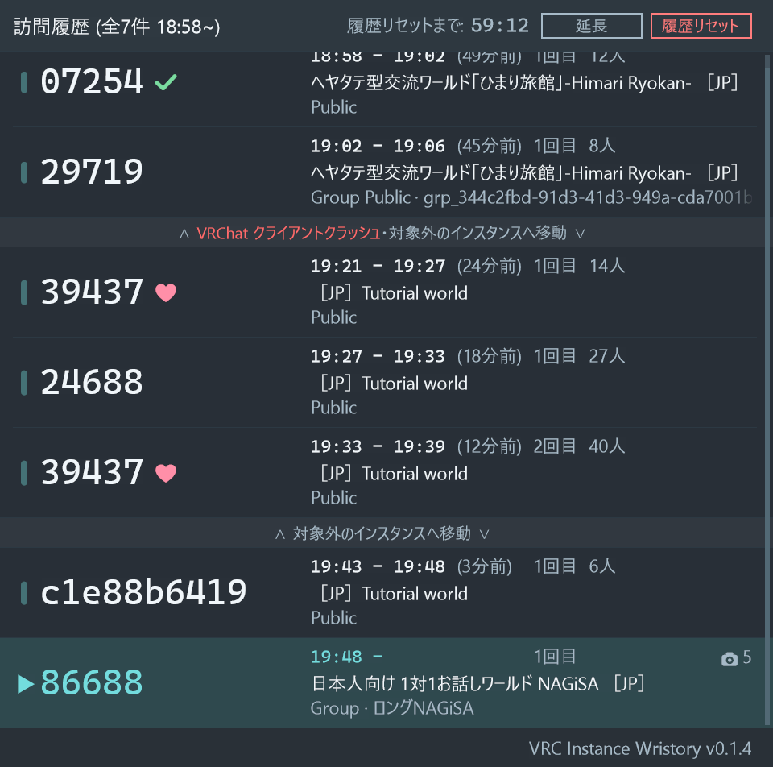

# VRC Instance Wristory

VRChatで訪問したインスタンスIDの履歴を、手首にSteamVRオーバーレイとして表示するWindows向け非公式アプリです。
多数のインスタンスが建っているワールドの周回などに役立ちます。




## 導入

1. [Releases](../../releases/latest) から、**`VRCInstanceWristoryApp-win-Setup.exe`** をダウンロードして実行します。
2. 「Windows によって PC が保護されました」と出た場合は、「詳細情報」を押してから「実行」を押します。
3. 初期設定で「AFK を検知する」をオンにした場合は、VRChat と OSC で通信するために Windows ファイアウォールの許可が必要です。


## 仕組み

- VRChatログファイル（`%UserProfile%\AppData\LocalLow\VRChat\VRChat`）と各種ソフトウェアの動作状態だけを読み取って動作します。VRChat API は使用しません。
- 新しい版を確かめるときに、GitHub（このリポジトリの Releases）へ問い合わせます。送るのはふつうの Web の問い合わせだけで、記録の中身は送りません。
- 「AFK を検知する」をオンにしたときだけ、VRChat と OSC でやりとりするため、この PC の中とローカルのネットワークで通信します（Windows のファイアウォールの許可を求められます）。
- 行のボタンでインスタンスやグループのページを開くと、既定のブラウザで vrchat.com を開きます。


## 動作環境

| 項目 | 内容 |
| --- | --- |
| OS | Windows 11 x64 |
| ランタイム | 不要（配布ファイルに .NET 10 のランタイム及び System.Drawing.Common を同梱） |
| VR | SteamVR（OpenVR SDK v2.15.6） |
| VRChat | Steam版 |

ビルドには .NET 10 SDK が必要です（開発機では 10.0.401 で確認）。

## ビルド

```powershell
pwsh scripts\publish.ps1              
```

`scripts\publish.ps1` は以下を順に行います。手動で実行する場合も同じです。

```powershell
dotnet test
dotnet publish src\VRCInstanceWristory -c Release -o dist\VRCInstanceWristory
dist\VRCInstanceWristory\VRCInstanceWristory.exe --render-sample <確認用のpng>
```

> **コードを改変した場合は必ずここまで実行してください。**
> アプリは `dist\VRCInstanceWristory` から起動するので、`dotnet build` や `dotnet test` が通っても
> `dist` を更新しなければ実際に変更は適用されません。publish の前にアプリを終了してください。

`dist\VRCInstanceWristory` に実行フォルダーができます。中身は次のとおりです。

```
VRCInstanceWristory.exe         本体
openvr_api.dll                  OpenVR SDK v2.15.6（win64）
*.dll                           .NET のランタイム等
Resources\actions.json          SteamVR Input の action manifest
Resources\bindings\*.json       機器別の既定binding
Resources\vrcinstancewristory.vrmanifest  SteamVRへアプリを識別させるmanifest
THIRD-PARTY-NOTICES.md          同梱物の権利表示
licenses\                       OpenVR SDK・Velopack・.NET のライセンス全文
```